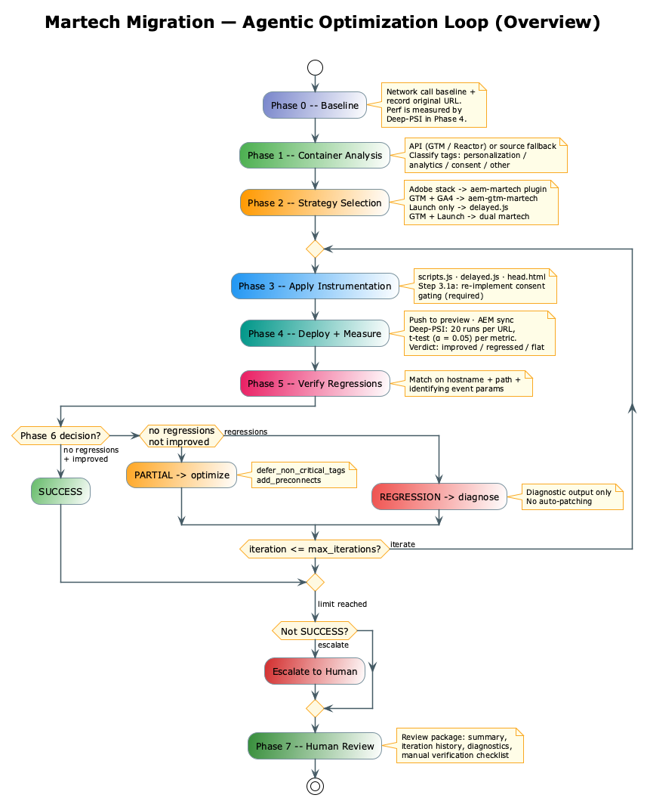
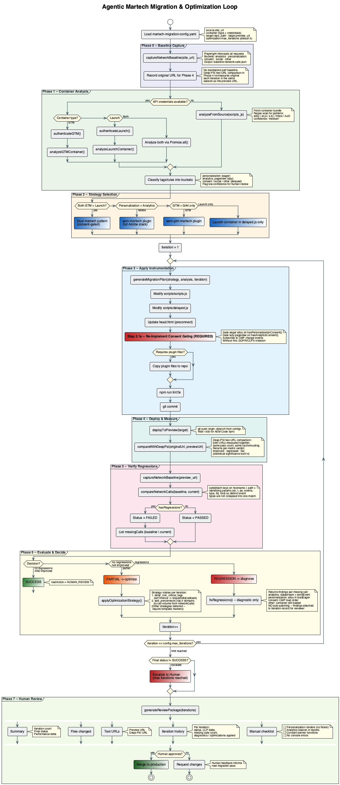

# Agentic Martech Migration & Optimization Loop

When migrating a customer site to Edge Delivery Services, martech integrations must be restructured to align with EDS performance best practices. This workflow defines the agentic optimization cycle that automates the bulk of that migration — detecting the existing stack, extracting only what needs to move, applying the changes, and iterating until performance improves and no third-party call regressions exist.

A developer always reviews and approves the result before it ships.

## Extraction Boundary (Critical Constraint)

This skill does **not** decompose the entire container. Only two categories are extracted from the container into EDS code:

| What | Where it goes in EDS | Why |
|------|----------------------|-----|
| **Personalization** (Target / AJO propositions) | `scripts.js` → `loadEager` | Must fire before first paint to prevent content flicker |
| **Analytics page view beacon** | `scripts.js` → `loadLazy` | Fires after LCP without blocking rendering |

Everything else — cookie consent, social pixels, RUM, remaining analytics events, marketing tags — **stays inside the original container** and loads in `scripts/delayed.js` as a black box. The container URL is preserved; only its timing changes (moved to delayed).

**EDS loading phases:**

| Phase | What loads | Mechanism |
|-------|-----------|-----------|
| Eager | Personalization (alloy.js / WebSDK propositions) | `await` in `loadEager` |
| Lazy | Analytics page view beacon (`sendEvent`) | `loadLazy` after LCP |
| Delayed | Container URL + everything else | `requestIdleCallback` or `setTimeout(3s)` |

## Overview



```
┌──────────────────────── ONE-TIME SETUP ────────────────────────┐
│                                                                 │
│  Phase 0: Baseline          Phase 1: Container Analysis         │
│  ┌────────────────┐         ┌────────────────────────────┐      │
│  │ Network calls  │         │ GTM API / Reactor API       │      │
│  │ Deep-PSI score │──────▶  │ Classify tags & rules       │      │
│  └────────────────┘         └────────────────────────────┘      │
│                                       │                         │
│                          Phase 2: Strategy Selection            │
│                          ┌────────────────────────────┐         │
│                          │ aem-martech · gtm-martech   │         │
│                          │ delayed.js · dual pattern   │         │
│                          └────────────────────────────┘         │
└─────────────────────────────────────────────────────────────────┘
                                   │
                  ┌────────────────▼────────────────┐
                  │    OPTIMIZATION LOOP (max N)     │
                  │                                  │
                  │  Phase 3         Phase 4         │
                  │  ┌──────┐       ┌──────────┐    │
                  │  │APPLY │──────▶│ DEPLOY & │    │
                  │  │Instr.│       │ MEASURE  │    │
                  │  └──────┘       └──────────┘    │
                  │      ▲               │           │
                  │      │          Phase 5          │
                  │      │          ┌──────────┐     │
                  │      │          │  VERIFY  │     │
                  │      │          │ Regress. │     │
                  │      │          └──────────┘     │
                  │      │               │           │
                  │      │          Phase 6          │
                  │      │          ┌──────────┐     │
                  │      │          │ EVALUATE │     │
                  │      │          │ & DECIDE │     │
                  │      │          └──────────┘     │
                  │      │         /    |    \        │
                  │  PARTIAL  REGRESS.  │  SUCCESS   │
                  │  Optimize  Fix      │  ──────────┼──▶ Phase 7
                  │      └─────────────┘             │    Human
                  │                                  │    Review
                  └──────────────────────────────────┘
```

## Prerequisites

### Required Access

| Access | Purpose | Notes |
|--------|---------|-------|
| Customer `scripts.js` | Detect container type and URL | **Always required** — primary input |
| Customer Codebase | Apply instrumentation changes | Git repository access |
| Deep-PSI Tool | Measure performance | https://tools.aem.live/tools/deep-psi/deep-psi.html |

### Optional: Container API Access (Phase 2 capability)

When API access is available, the agent can read the container programmatically for richer analysis. If not available, fall back to **source code analysis** of `scripts.js` and the loaded container JS.

| API | Purpose | How to Obtain |
|-----|---------|---------------|
| GTM API v2 | Read tags, rules, triggers | Google Cloud Console → Enable Tag Manager API → Service Account |
| Launch Reactor API | Read rules, data elements | Adobe Developer Console → Create Project → Add Reactor API |

**Fallback (no API access):** Fetch the container URL, parse the minified JS, and infer tag classifications from function names, URLs, and patterns in the bundle.

### Reference Resources

| Resource | URL |
|----------|-----|
| aem-martech plugin | https://github.com/adobe-rnd/aem-martech/ |
| aem-gtm-martech plugin | https://github.com/adobe-rnd/aem-gtm-martech/ |
| EDS Martech Integration Guide | https://www.aem.live/developer/martech-integration |
| EDS Target Integration Guide | https://www.aem.live/developer/target-integration |
| WKND Martech Hybrid (reference project) | https://github.com/hlxsites/wknd/blob/adobe-martech-hybrid/scripts/scripts.js#L28-L61 |
| Deep-PSI | https://tools.aem.live/tools/deep-psi/deep-psi.html |

> **Test baseline:** Use the [WKND martech hybrid](https://adobe-martech-hybrid--wknd--hlxsites.aem.live/) project as the integration test reference. It includes a real Launch container, dummy IMS Org ID, and Datastream ID wired to the Sites Internal Org (Target, AEP, Analytics).

---

## Phase 0: Baseline Capture

Before any changes, capture the baseline state.

### Step 0.0: Source Site EDS Preflight

Probe the source site for EDS boilerplate (`aem.js` or `lib-franklin.js`, in `/scripts/` or `/commons/scripts/`, or anywhere in the page's `<script>` imports). If the source is already on EDS, **abort the loop** — there's nothing to migrate, and producing a "migration" would silently generate a less-sophisticated version of the existing setup.

```javascript
const eds = await detectExistingEdsSite(config.source.site_url);
if (eds.isEds) {
  throw new Error(
    `SOURCE_ALREADY_EDS: ${config.source.site_url} is already on Edge Delivery `
    + `(${eds.evidence}). The loop migrates legacy sites to EDS — there's nothing `
    + `to migrate here. To replicate this site's setup into a fresh repo, the user `
    + `should run a "clone existing EDS setup" flow instead (out of scope for this loop).`,
  );
}
```

**Implementation:** See [`references/source-code-analysis.md`](../references/source-code-analysis.md#source-site-eds-preflight-phase-0) for `detectExistingEdsSite` (path probes + HTML import scan covering both boilerplate filenames and both common path conventions).

> **Why this matters:** sites being audited for migration may already have been migrated by a prior project, or by a different team. Both `petplace.com` and `marutisuzuki.com` are real examples that would have looked like legacy migration candidates from network signals alone (heavy Adobe Launch + alloy + Analytics) but are in fact already on EDS — `marutisuzuki.com` uses non-standard `/commons/scripts/` paths that path-only probes miss; the HTML scan catches it. Without this preflight, the loop wastes Phase 1–7 producing the wrong code.

### Step 0.1: Capture Network Call Baseline

Use Playwright to intercept all third-party requests on the original site, then categorize by type (analytics, personalization, consent, social, other).

**Implementation:** See [`references/extraction-scripts.md`](../references/extraction-scripts.md) for the full `captureNetworkBaseline`, `isAnalyticsCall`, `isPersonalizationCall`, `categorizeCall`, and related functions.

**Output:** `baseline-network-calls.json`

### Step 0.2: Note the Baseline URL

Deep-PSI is a **two-URL comparison tool**: it runs 20 PSI iterations per URL in the same session (shared cache-busting logic, same pass count) and applies a two-sample t-test per metric. The loop uses it end-to-end — baseline and iteration are measured together in Phase 4, not separately.

This means Phase 0 doesn't need to capture performance numbers on their own. Record the original URL so Phase 4 can pass it to Deep-PSI alongside the preview URL each iteration.

```javascript
// Baseline record is just the URL; Deep-PSI measures original and preview
// together every iteration, keeping both sides in the same measurement
// environment.
const baseline = { originalUrl: config.source.site_url };
```

> **Why not measure baseline once and reuse?** Comparing a baseline captured on day 1 against preview captured on day 3 mixes measurement environments (different Lighthouse versions on the server, different cache states, different network conditions). Re-measuring the original URL each iteration — in the same Deep-PSI session as the preview URL — eliminates that drift.

---

## Phase 1: Container Analysis

Container analysis has three paths. Use the supplied report when one is provided; the API path when credentials are available; otherwise fall back to source code analysis.

### Path 0: Use a Supplied Detection Report (When `container_analysis` Is Set)

If the workflow config provides `container_analysis.vendors[]`, skip detection entirely. Validate the shape (each entry has `vendor`, `category`, `phase`) and pass the list straight through to Phase 2. This lets external audit tools, prior loop runs, or hand-curated reports drive the migration without re-discovering vendors.

```javascript
function loadSuppliedAnalysis(supplied) {
  // Validate required fields per entry; missing category/phase falls back to
  // detection rather than guessing — better to fail loudly than ship a wrong
  // extraction boundary.
  for (const v of supplied.vendors ?? []) {
    if (!v.vendor || !v.category || !v.phase) {
      throw new Error(`SUPPLIED_ANALYSIS_INVALID: ${JSON.stringify(v)} missing vendor/category/phase`);
    }
  }
  return {
    vendors: supplied.vendors,
    hasPersonalization: supplied.vendors.some((v) => v.category === 'personalization'),
    hasAnalytics: supplied.vendors.some((v) => v.category.startsWith('analytics')),
    confidence: 'high',
    source: 'supplied',
  };
}
```

> Not every input will know `category` and `phase` for every vendor. If an entry has only `vendor`, the loop runs **classification-only** — looking the vendor up in the same `VENDOR_SIGNATURES` map Path A uses, no regex scan or LLM call. This avoids re-detecting what's already known while still filling in gaps. Implementation lives in [`references/source-code-analysis.md`](../references/source-code-analysis.md) under "Classification Lookup".

### Path A: Source Code Analysis (Always Available)

Path A is a **four-stage pipeline**. Earlier stages are cheap and deterministic; later stages are paid but catch what earlier ones miss. This is the same pattern used across the workflow — do the free, high-confidence work first, then escalate.

| Stage | What | Cost | Confidence |
|-------|------|------|------------|
| 1. SDK regex scan | Match known vendor signatures (Adobe, GTM, Optimizely, VWO, Dynamic Yield, Segment, Mixpanel, Amplitude, Heap, Hotjar, Contentsquare, OneTrust, Cookiebot, …) in the raw bundle | Free | High when matched |
| 1.5. Launch extension scan | Adobe Launch containers don't embed vendor SDKs — they list extensions by `modulePath` strings. This stage maps extension package names (e.g., `facebook-pixel`, `acronym-gtag.js`, `web-sdk`) to vendor metadata. | Free | High when matched; unknown extensions surface as `low` for review |
| 2. Slice + format | Extract ±4 KB character windows around *near-miss anchors* (`track`, `experiment`, `consent`, etc.) and format each slice with `prettier` | ~1 s × ≤10 slices | — |
| 3. LLM triage | Classifier returns `{vendor, category, phase, confidence, reasoning}` per slice | Paid; capped at `MAX_LLM_SLICES=10` | Self-reported |

The staged order matters: deterministic stages handle the 80% case for free; slicing avoids sending a 500 KB bundle to the LLM; `MAX_LLM_SLICES` is a hard cost ceiling. **Without Stage 1.5**, a Launch container that loads alloy + GA4 + Floodlight at runtime would appear vendor-free to Stage 1 (real failure mode caught during a real-site audit).

```javascript
// Skeleton — full implementation in references/source-code-analysis.md.
async function analyzeFromSource(scriptsJsContent, containerUrl) {
  const containerType = detectContainerType(scriptsJsContent);
  const source = await fetch(containerUrl).then((r) => r.text());
  const sdkMatches = scanSignatures(source);                                       // Stage 1
  const extMatches = containerType === 'launch' || containerType === 'both'
    ? scanLaunchExtensions(source) : [];                                           // Stage 1.5
  const matches = mergeVendorFindings(sdkMatches, extMatches);
  const residual = await triageResidual(source, matches);                          // Stages 2 + 3
  const all = [...matches, ...residual];
  return {
    containerType,
    vendors: all,
    hasPersonalization: all.some((m) => m.category === 'personalization'),
    hasAnalytics: all.some((m) => m.category.startsWith('analytics')),
    confidence: all.every((m) => m.confidence === 'high') ? 'high' : 'mixed',
  };
}
```

**Implementation:** See [`references/source-code-analysis.md`](../references/source-code-analysis.md) for the full `VENDOR_SIGNATURES` table, `triageResidual` (slice + format + classify), `formatSlice` (prettier-on-demand with soft fail), `dedupeFindings`, and the LLM classifier prompt contract.

> **Flag for human review** any finding where `confidence !== 'high'` — regardless of whether it came from regex or the LLM. The LLM stage expands *coverage*, not *certainty*.

### Path B: Container API Analysis (When Credentials Available)

Authenticate to the GTM or Launch Reactor API, fetch all tags/rules, and classify each into: `personalization`, `analytics_pageview`, `analytics_events`, `consent`, `social`, `other`.

**Implementation:** See [`references/container-analysis-scripts.md`](../references/container-analysis-scripts.md) for `authenticateGTM`, `authenticateLaunch`, `analyzeGTMContainer`, `analyzeLaunchContainer`, `classifyTag`, `classifyLaunchRule`, and `isPageViewTrigger`.

> Also identifies rules that become **redundant after migration** (personalization/analytics now handled in EDS code) — flag these for cleanup inside the container.

**Output:** `container-analysis.json`

---

## Phase 2: Strategy Selection

Based on the container analysis output, select the appropriate migration approach before writing any code.

### Extraction Rule

Regardless of strategy, the extraction boundary is always the same:

- **Extract → EDS code:** personalization tags + analytics page view beacon only
- **Leave in container → delayed phase:** consent, social pixels, RUM, all other analytics events, any ambiguous tags
- **Flag for human review:** any tags that cannot be confidently classified

### Strategy Decision Tree

```yaml
decision_tree:
  - if: personalization tags detected AND analytics detected
    then: Use aem-martech plugin (Approach 1 — full eager/lazy/delayed)

  - if: GTM with GA4 only (no personalization)
    then: Use aem-gtm-martech plugin

  - if: Launch with analytics only (no Target)
    then: Approach 2 — Launch container in delayed.js only

  - if: Both GTM and Launch
    then: Dual martech pattern (both containers in delayed.js, consent-gated)

  - if: Direct gtag.js (G-XXXXXXXXXX measurement ID and/or AW-XXXXXXXXXX Ads accounts)
        WITHOUT a GTM container
    then: Approach 5 — extract GA4 page view to lazy, keep Google Ads conversion pings
          in delayed.js. No container URL exists, so no plugin is used; gtag is called
          directly.
```

**Output:** `migration-plan.json` — records the chosen approach, plugin type, config variables extracted, what is being extracted vs left in the container, and any items flagged for human review.

---

## Phase 3: Apply Instrumentation

### Step 3.1: Generate Instrumentation Code

Select the plugin template for the chosen strategy and populate config variables from the container analysis output.

**Templates:** See [`references/aem-martech-plugin-template.md`](../references/aem-martech-plugin-template.md) for complete `scripts.js`, `delayed.js`, and `head.html` patterns for both `aem-martech` (Adobe stack) and `aem-gtm-martech` (Google stack).

> All current EDS repos use `aem.js` — confirm with `detectBoilerplate(scriptsJs)` before generating code. See [Boilerplate Compatibility](#boilerplate-compatibility).

### Step 3.1a: Re-implement Consent Gating (Required)

**This is not optional.** Consent checks that previously lived inside the container no longer protect the personalization and analytics calls we just extracted into `scripts.js`. Without re-implementing them, martech calls will fire before the user has given consent — a GDPR/CCPA violation.

For every extraction:

1. Identify the consent tool in use (OneTrust, Cookiebot, custom) from Phase 0 baseline.
2. Gate the eager alloy init on `hasPersonalizationConsent()`.
3. Gate the lazy page-view beacon on `hasAnalyticsConsent()`.
4. Subscribe to the consent tool's change event so calls fire after late-granted consent.

**Implementation:** See [`references/consent-gated-architecture.md`](../references/consent-gated-architecture.md) for `hasAnalyticsConsent`, `hasPersonalizationConsent`, OneTrust event listener patterns, and the complete consent-gated `loadEager` structure.

### Step 3.2: Apply Changes to Codebase

```javascript
async function applyInstrumentation(repoPath, migrationPlan, iteration) {
  // 1. Modify scripts/scripts.js
  await modifyScriptsJS(repoPath, migrationPlan.scriptsChanges);

  // 2. Modify scripts/delayed.js
  await modifyDelayedJS(repoPath, migrationPlan.delayedChanges);

  // 3. Add head.html preconnects
  await modifyHeadHTML(repoPath, migrationPlan.preconnects);

  // 4. Add martech plugin files if needed
  if (migrationPlan.requiresPlugin) {
    await copyPluginFiles(repoPath, migrationPlan.pluginType);
  }

  // 5. Run lint
  await runLint(repoPath);

  // 6. Commit — iteration 1 creates the single commit the final PR will
  // carry; subsequent iterations amend it so the branch stays at one
  // commit no matter how many tuning passes run. Phase 4 force-pushes
  // when amended=true.
  const amended = iteration > 1;
  await gitCommit(repoPath, 'Apply martech instrumentation', { amend: amended });
  return { amended };
}
```

> **Why amend instead of stacking commits?** Each iteration layers optimizations on the same migration — there's no reviewer value in seeing "iter 1: apply martech", "iter 2: defer non-critical tags", "iter 3: add preconnects" as separate commits. The final PR should have one commit describing the migration; amend keeps it that way without a squash step in Phase 7. The preview URL is branch-scoped, so force-pushing the amended commit still triggers AEM Code Sync and Deep-PSI measures the right state.

---

## Phase 4: Deploy & Measure

### Step 4.1: Deploy to Preview

```bash
git push origin martech-migration
# Wait for AEM Code Sync (~30s)
sleep 30
```

### Step 4.2: Run Deep-PSI Comparison

Feed both URLs — original and preview — into Deep-PSI's comparison form. It runs 20 PSI iterations per URL in the same session, then emits:

1. A results table per URL with a stable (avg ± stddev) summary row across all runs.
2. A **Statistical Significance Test** section (two-sample t-test, α = 0.05) that labels each metric's difference as "Significant" or "Not significant" with a p-value.

Deep-PSI supplies the significance call; the loop combines that with a direction check (preview vs. original stable average, respecting that lower-is-better for time/CLS and higher-is-better for Score) to produce the per-metric verdict: `improved` / `regressed` / `flat`. No local noise floor — the t-test already filters noise.

```javascript
// Skeleton — full implementation in references/deep-psi-integration.md.
async function compareWithDeepPsi(originalUrl, previewUrl, label = 'iteration') {
  // 1. Launch headless Chromium (Playwright, installed on demand)
  // 2. Navigate to tools.aem.live/tools/deep-psi/deep-psi.html
  // 3. Fill #url1 (original), #url2 (preview); click Submit
  // 4. Wait for #significancetestresults li to appear (up to 10 min)
  // 5. Scrape stable-avg row per URL + significance list via DOM query
  // 6. return parseDeepPsiOutput(raw, { originalUrl, previewUrl, label });
}
```

**Implementation:** See [`references/deep-psi-integration.md`](../references/deep-psi-integration.md) for the full `ensurePlaywright`, `compareWithDeepPsi`, `parseDeepPsiOutput`, the validated selectors (`#url1`, `#url2`, `#significancetestresults li`), the `DEEP_PSI_METRICS` / `DEEP_PSI_CORE` / `LOWER_IS_BETTER` constants, the output shape, and failure modes.

> **Units:** Deep-PSI reports time metrics (FCP, SI, LCP, TTI, TBT) in **seconds**, CLS as a unitless ratio, and Score as a 0–100 integer. Downstream code that renders deltas should annotate units when presenting to humans.

> **Why no fallback measurement system?** A fallback that measures differently silently changes the measurement system mid-loop and produces incomparable numbers. If Deep-PSI fails, the loop escalates via the handlers in [Error Handling](#error-handling) — retry first, then human review.

### Step 4.3: Use Deep-PSI's Verdict Directly

No local delta math. The Phase 6 decision reads `result.overallImproved` and `result.hasRegressions` from the Deep-PSI comparison — the statistical significance is already baked in.

---

## Phase 5: Verify Regressions

### Step 5.1: Capture Post-Migration Network Calls

```javascript
async function capturePostMigrationCalls(previewUrl) {
  // Same as baseline capture
  return await captureNetworkBaseline(previewUrl);
}
```

### Step 5.2: Compare Network Calls

```javascript
function compareNetworkCalls(baseline, current) {
  const report = {
    analytics: compareCallCategory(baseline.analytics, current.analytics),
    personalization: compareCallCategory(baseline.personalization, current.personalization),
    consent: compareCallCategory(baseline.consent, current.consent),
    social: compareCallCategory(baseline.social, current.social),
    other: compareCallCategory(baseline.other, current.other),
    
    // Summary
    totalBaseline: baseline.all.length,
    totalCurrent: current.all.length,
    missingCalls: [],
    newCalls: [],
    hasRegressions: false
  };
  
  // Find missing calls (CRITICAL - these are regressions)
  for (const baselineCall of baseline.all) {
    const found = current.all.some(c => callsMatch(baselineCall, c));
    if (!found) {
      report.missingCalls.push(baselineCall);
      report.hasRegressions = true;
    }
  }
  
  // Find new calls (informational)
  for (const currentCall of current.all) {
    const found = baseline.all.some(c => callsMatch(currentCall, c));
    if (!found) {
      report.newCalls.push(currentCall);
    }
  }
  
  return report;
}

// Determines whether two network calls represent the same event. Ignoring
// query strings entirely collapses distinct beacons (e.g., two different
// Analytics event types hitting /b/ss/rsid) into a single match and hides real
// regressions. We match on hostname + pathname plus a small set of identifying
// query params that mark what the call actually is.
//
// IDENTIFYING_PARAMS is conservative: only params known to distinguish event
// type for common martech endpoints. Timestamps, session IDs, and cache
// busters are deliberately excluded so run-to-run jitter doesn't cause false
// positive regressions.
const IDENTIFYING_PARAMS = [
  'en',         // GA4 event_name
  't',          // GA classic hit type (pageview, event, ...)
  'pe',         // Adobe Analytics event type
  'events',     // Adobe Analytics events list
  'type',       // WebSDK event type (e.g., "decisioning.propositionDisplay")
  'eventType',  // alternate casing
  'tid',        // GA tracking id
  'rsid',       // Adobe Analytics report suite id
];

function callsMatch(call1, call2) {
  const url1 = new URL(call1.url);
  const url2 = new URL(call2.url);
  if (url1.hostname !== url2.hostname) return false;
  if (url1.pathname !== url2.pathname) return false;

  // For endpoints where the path alone doesn't identify the event (Analytics,
  // GA, WebSDK all use a single endpoint for many event types), require the
  // identifying params to also match.
  for (const param of IDENTIFYING_PARAMS) {
    const v1 = url1.searchParams.get(param);
    const v2 = url2.searchParams.get(param);
    if (v1 !== v2) return false;
  }
  return true;
}
```

### Step 5.3: Generate Regression Report

```javascript
function generateRegressionReport(comparison) {
  return {
    status: comparison.hasRegressions ? 'FAILED' : 'PASSED',
    
    summary: {
      baselineCalls: comparison.totalBaseline,
      currentCalls: comparison.totalCurrent,
      missingCount: comparison.missingCalls.length,
      newCount: comparison.newCalls.length
    },
    
    critical: comparison.missingCalls.map(c => ({
      url: c.url,
      category: categorizeCall(c.url),
      impact: 'MISSING - This call was present in baseline but not in migrated version'
    })),
    
    informational: comparison.newCalls.map(c => ({
      url: c.url,
      category: categorizeCall(c.url),
      note: 'NEW - This call was not present in baseline'
    })),
    
    recommendation: comparison.hasRegressions 
      ? 'Investigate missing calls before proceeding'
      : 'No regressions detected - safe to continue'
  };
}
```

---

## Phase 6: Evaluate & Decide

### Step 6.1: Evaluate Results

```javascript
// Reads the performance verdict directly from the Deep-PSI comparison result
// (no local delta math) and combines it with the network regression report.
// Deep-PSI already applies statistical significance across multiple Lighthouse
// passes, so we don't re-compute noise floors here.
//
// Two independent regression axes:
//   - perf regression:    a core Deep-PSI metric got significantly worse
//   - network regression: a baseline third-party call is missing post-migration
// Either failure short-circuits to REGRESSION.
function evaluateIteration(comparison, regressionReport, iteration) {
  const perfImproved = comparison.overallImproved;
  const perfRegressed = comparison.hasRegressions;
  const networkRegressed = regressionReport.hasRegressions;

  let status;
  let nextAction;
  if (networkRegressed || perfRegressed) {
    status = 'REGRESSION';
    nextAction = 'FIX_REGRESSIONS';
  } else if (perfImproved) {
    status = 'SUCCESS';
    nextAction = 'PROCEED_TO_HUMAN_REVIEW';
  } else {
    // Neither improved nor regressed — Deep-PSI called it flat. Try another
    // optimization strategy before giving up.
    status = 'PARTIAL';
    nextAction = 'ATTEMPT_OPTIMIZATION';
  }

  return {
    iteration,
    perfImproved,
    perfRegressed,
    networkRegressed,
    status,
    nextAction,
  };
}
```

### Step 6.2: Optimization Strategies

When the decision is `PARTIAL` (no regressions, but Deep-PSI didn't call improvement significant), `applyOptimizationStrategy` runs one strategy from a rotating list. Each strategy is idempotent — running it twice is a no-op — so the loop is safe under restart.

Current strategies:

| Name | What it does |
|---|---|
| `defer_non_critical_tags` | Switches `scripts/delayed.js` from `setTimeout(fn, 3000)` to `requestIdleCallback(fn, { timeout: 5000 })` (with a `setTimeout` fallback for Safari) |
| `add_preconnects` | Ranks observed third-party domains by call count and adds up to 5 `<link rel="preconnect">` entries to `head.html` |

**Implementation:** See [`references/optimization-strategies.md`](../references/optimization-strategies.md) for the full `OPTIMIZATION_STRATEGIES` array, the strategy contract (`name`, `description`, `condition`, `apply`), idempotency rules, deferred strategies (`lazy_load_alloy`, `reduce_data_layer_payload`), and guidance for adding new ones.

### Step 6.3: Regression Fixes

When a regression is detected (a baseline network call is missing post-migration), `fixRegressions` returns **diagnostic findings only** — it does not auto-patch. A missing call almost always means the extracted instrumentation is broken, and auto-rewriting on top of a broken baseline risks compounding the problem.

The findings are attached to the iteration record as `record.diagnostics` and surfaced to the human reviewer. Any failing regression criterion triggers another iteration, then escalates.

Per-category diagnoses (checks the loop performs against `scripts/scripts.js` and `scripts/delayed.js`):

| Category | What it checks |
|---|---|
| `analytics` | Is `datastreamId` present? Is `sendEvent` / `pageView` called? |
| `personalization` | Does `loadEager` contain `alloy`? |
| `consent` | Is a known consent tool referenced (OneTrust / Optanon / cookielaw)? |
| default | Is the original container URL still loaded in `delayed.js`? |

**Implementation:** See [`references/regression-diagnostics.md`](../references/regression-diagnostics.md) for the full `fixRegressions`, `diagnoseMissingCall`, the finding shape, and guidance for extending to new categories.

---

## Phase 7: Human Review

### Step 7.1: Generate Review Package

```javascript
function generateReviewPackage(iterations) {
  const last = iterations[iterations.length - 1];

  return {
    summary: {
      totalIterations: iterations.length,
      finalStatus: last.decision.status,
      // Full Deep-PSI comparison (per-metric verdicts + original/preview numbers)
      comparison: last.comparison,
      regressionStatus: last.regressionReport.status,
    },

    filesChanged: [
      'scripts/scripts.js',
      'scripts/delayed.js',
      'head.html',
      // ... other files
    ],

    diffLinks: {
      scriptsJs: 'https://github.com/org/repo/compare/main...martech-migration#diff-scripts-js',
      // ...
    },

    testUrls: {
      preview: 'https://martech-migration--repo--org.aem.page/',
      // Pre-filled with the same URLs the loop used so the reviewer can
      // reproduce the comparison with one click instead of re-typing both.
      deepPsi: `https://tools.aem.live/tools/deep-psi/deep-psi.html?url1=${encodeURIComponent(last.comparison.originalUrl)}&url2=${encodeURIComponent(last.comparison.previewUrl)}`,
    },

    manualChecks: [
      '[ ] Personalization renders without flicker',
      '[ ] Analytics data appears in reports',
      '[ ] Consent banner functions correctly',
      '[ ] No console errors related to martech',
    ],

    // One row per iteration with the LCP verdict (the metric reviewers care
    // about most) plus regression counts. Full per-metric detail is in
    // `comparison` on each iteration record.
    iterationHistory: iterations.map((i) => ({
      iteration: i.iteration,
      status: i.decision.status,
      lcpVerdict: i.comparison?.metrics.lcp.verdict ?? 'unknown',
      lcpOriginal: i.comparison?.metrics.lcp.original ?? null,
      lcpPreview: i.comparison?.metrics.lcp.preview ?? null,
      missingCalls: i.regressionReport.missingCount,
    })),
  };
}
```

### Step 7.2: Present to Human

```markdown
## Martech Migration Review

### Summary
- **Iterations:** ${totalIterations}
- **Final Status:** ${finalStatus}
- **Performance (Deep-PSI verdict, t-test α = 0.05):**
  - LCP: ${comparison.metrics.lcp.verdict} (${comparison.metrics.lcp.original}s → ${comparison.metrics.lcp.preview}s, p = ${comparison.metrics.lcp.pValue})
  - CLS: ${comparison.metrics.cls.verdict} (${comparison.metrics.cls.original} → ${comparison.metrics.cls.preview}, p = ${comparison.metrics.cls.pValue})
  - TBT: ${comparison.metrics.tbt.verdict} (${comparison.metrics.tbt.original}s → ${comparison.metrics.tbt.preview}s, p = ${comparison.metrics.tbt.pValue})

### Files Changed
${filesChanged.map(f => `- \`${f}\``).join('\n')}

### Test URLs
- Preview: ${previewUrl}
- Deep-PSI: ${deepPsiUrl}

### Manual Verification Checklist
${manualChecks.join('\n')}

### Approve or Request Changes?
```

---

## Detailed Flow



---

## Loop Orchestration

```javascript
async function runOptimizationLoop(config) {
  const maxIterations = config.optimization?.max_iterations ?? 5;
  const iterations = [];

  // Phase 0 — only the network baseline is captured up front (it's cheap and
  // doesn't suffer from measurement drift the way performance metrics do).
  // Performance is measured fresh each iteration via Deep-PSI two-URL
  // comparison, which re-samples the original URL alongside the preview URL
  // in the same session.
  const baseline = {
    originalUrl: config.source.site_url,
    network: await captureNetworkBaseline(config.source.site_url),
  };

  // Phase 1–2 run once: analysis and strategy don't change across iterations.
  const containerAnalysis = await analyzeContainer(config);
  const strategy = selectStrategy(containerAnalysis);

  for (let i = 1; i <= maxIterations; i++) {
    console.log(`\n=== Iteration ${i} ===\n`);

    // Phase 3 — apply instrumentation. On iteration 1 this is the full
    // migration; later iterations layer on optimizations from the previous
    // iteration's result. applyInstrumentation amends the existing commit
    // from iteration 2 onward so the branch stays at one clean commit.
    const plan = generateMigrationPlan(strategy, containerAnalysis, i);
    const { amended } = await applyInstrumentation(config.target.repo_path, plan, i);

    // Phase 4 — deploy (force-push-with-lease when the commit was amended),
    // then run Deep-PSI comparison: original vs preview, measured together
    // in one session so both sides share the same pass count, cache state,
    // and cache-busting logic.
    await deployToPreview(config.target, { amended });
    const comparison = await compareWithDeepPsi(
      baseline.originalUrl,
      config.target.preview_url,
      `iter-${i}`,
    );

    // Phase 5 — network regression check.
    const currentNetwork = await captureNetworkBaseline(config.target.preview_url);
    const regressionReport = compareNetworkCalls(baseline.network, currentNetwork);

    // Phase 6 — decide what to do next. Deep-PSI's verdict drives the
    // performance axis; the network report drives the regression axis.
    const decision = evaluateIteration(comparison, regressionReport, i);
    const record = { iteration: i, plan, comparison, regressionReport, decision };

    if (decision.status === 'SUCCESS') {
      iterations.push(record);
      break;
    }
    if (decision.status === 'REGRESSION') {
      // Surface diagnostics for the human reviewer; don't auto-patch.
      record.diagnostics = await fixRegressions(config.target.repo_path, regressionReport);
    } else if (decision.nextAction === 'ATTEMPT_OPTIMIZATION') {
      // Strategies need both the container analysis and the current network
      // capture to make meaningful choices (e.g., which domains to preconnect).
      record.optimizations = await applyOptimizationStrategy(config.target.repo_path, i, {
        containerAnalysis,
        networkCalls: currentNetwork.all,
      });
    }
    iterations.push(record);
  }

  return generateReviewPackage(iterations);
}
```

---

## Orchestration Helper Functions

The loop orchestration above calls five functions that are defined here.

```javascript
// Unify supplied report, GTM API, Launch API, and source-code analysis behind
// a single interface. Order matters: a supplied report wins, then API access,
// then source fallback. This keeps detection cost (LLM calls, API quota) zero
// when the answer is already known.
async function analyzeContainer(config) {
  // Path 0 — pre-detection supplied. No detection cost incurred.
  if (config.container_analysis?.vendors?.length) {
    return loadSuppliedAnalysis(config.container_analysis);
  }

  const { type } = config.container;
  if (type === 'gtm') {
    const tagmanager = await authenticateGTM(config.container.gtm.api_credentials.service_account_key);
    return analyzeGTMContainer(tagmanager, config.container.gtm.account_id, config.container.gtm.container_id);
  }
  if (type === 'launch') {
    const { access_token } = await authenticateLaunch(
      config.container.launch.api_credentials.client_id,
      config.container.launch.api_credentials.client_secret,
      config.container.launch.api_credentials.org_id
    );
    return analyzeLaunchContainer(access_token, config.container.launch.property_id);
  }
  if (type === 'both') {
    const [gtm, launch] = await Promise.all([
      analyzeContainer({ ...config, container: { ...config.container, type: 'gtm' } }),
      analyzeContainer({ ...config, container: { ...config.container, type: 'launch' } })
    ]);
    return { gtm, launch, type: 'both' };
  }
  // Fallback: source code analysis when no API access
  return analyzeFromSource(config.source.scripts_js, config.container.url);
}

// Translate container analysis into a strategy choice
function selectStrategy(containerAnalysis) {
  const hasPersonalization = containerAnalysis.personalization?.length > 0
    || containerAnalysis.hasPersonalization;
  const hasAnalytics = containerAnalysis.analytics_pageview?.length > 0
    || containerAnalysis.hasAnalytics;
  // "direct gtag" means GA4 / Google Ads loaded via gtag.js without a GTM container
  // (the page references G-XXXXXXXXXX or AW-XXXXXXXXXX directly, not GTM-XXXXXXX).
  const hasDirectGtag = containerAnalysis.directGtag === true
    || containerAnalysis.vendors?.some?.((v) => v.vendor === 'ga4' || v.vendor === 'google-ads');
  const isGTM = containerAnalysis.type === 'gtm' || containerAnalysis.containerType === 'gtm';
  const isBoth = containerAnalysis.type === 'both' || containerAnalysis.containerType === 'both';
  const isLaunch = containerAnalysis.type === 'launch' || containerAnalysis.containerType === 'launch';
  const noContainer = !isGTM && !isBoth && !isLaunch;

  if (isBoth) return { plugin: 'dual', approach: 'dual-martech' };
  if (isGTM && !hasPersonalization) return { plugin: 'aem-gtm-martech', approach: 'gtm-only' };
  if (hasPersonalization && hasAnalytics) return { plugin: 'aem-martech', approach: 'full-adobe-stack' };
  // Direct gtag.js without a GTM container (e.g. site loads gtag.js with measurement IDs
  // G-XXXXXXXXXX and Ads accounts AW-XXXXXXXXXX directly). No container URL exists, so we
  // can't use `launch-delayed-only` — instead extract GA4 page view to lazy and leave Ads
  // conversion pings in delayed.js.
  if (noContainer && hasDirectGtag) return { plugin: null, approach: 'direct-gtag-lazy' };
  return { plugin: null, approach: 'launch-delayed-only' };
}

// Build the per-iteration instrumentation plan
function generateMigrationPlan(strategy, containerAnalysis, iteration) {
  const isDirectGtag = strategy.approach === 'direct-gtag-lazy';
  return {
    iteration,
    strategy,
    // What gets extracted into EDS code (extraction boundary)
    eager: strategy.approach === 'full-adobe-stack' ? ['alloy.js init', 'Target propositions'] : [],
    lazy: (strategy.approach === 'full-adobe-stack' || strategy.approach === 'gtm-only' || isDirectGtag)
      ? ['analytics page view beacon'] : [],
    // For direct-gtag-lazy there is NO container URL — only Ads pings + consent live in delayed.
    delayed: isDirectGtag
      ? ['Google Ads conversion pings (gtag direct)', 'consent', 'social pixels', 'remaining tags']
      : ['container URL', 'consent', 'social pixels', 'remaining tags'],
    requiresPlugin: !!strategy.plugin,
    pluginType: strategy.plugin,
    // Optimization hints for iteration > 1
    optimizations: iteration > 1 ? selectOptimizationForIteration(iteration) : []
  };
}

function selectOptimizationForIteration(iteration) {
  // iteration is 1-indexed; the first optimization runs on iteration 2.
  return OPTIMIZATION_STRATEGIES[(iteration - 2) % OPTIMIZATION_STRATEGIES.length];
}

// Runs the iteration's optimization strategy if its condition passes, threading
// through the container analysis and current network capture so strategies can
// make data-driven choices (e.g., which domains to preconnect).
async function applyOptimizationStrategy(repoPath, iteration, context) {
  const strategy = selectOptimizationForIteration(iteration);
  if (strategy.condition && !strategy.condition(context)) {
    return { skipped: strategy.name, reason: 'condition not met' };
  }
  const result = await strategy.apply(repoPath, context);
  return { name: strategy.name, ...result };
}

// Pushes to the configured preview branch and waits for AEM Code Sync. The
// branch is read from config so multi-branch workflows (e.g., parallel
// experiments) don't collide on a hardcoded name. When Phase 3 amended the
// previous iteration's commit, force-push with lease so we rewrite the remote
// branch atomically without clobbering unexpected remote work.
async function deployToPreview(target, { amended = false } = {}) {
  const { execSync } = require('child_process');
  const branch = target.branch ?? 'martech-migration';
  const pushArgs = amended ? `--force-with-lease ${branch}` : `${branch}`;
  execSync(`git push origin ${pushArgs}`, { cwd: target.repo_path, stdio: 'inherit' });
  // AEM Code Sync webhook latency is usually <30s; give it a fixed pause
  // before measurement to avoid racing the preview URL.
  await new Promise((resolve) => setTimeout(resolve, 30000));
}
```

---

## Boilerplate Compatibility

All current EDS projects use `aem.js`. The `loadEager` hook is an exported default function:

```javascript
// scripts/scripts.js — aem.js boilerplate (all current repos)
export default async function loadEager(doc) {
  // ... decoration code ...
  // martech eager init goes here
}
```

```javascript
function detectBoilerplate(scriptsJsContent) {
  if (/from ['"]\.\/aem\.js['"]/i.test(scriptsJsContent)) return 'aem.js';
  // lib-franklin.js is fully retired — warn if encountered
  console.warn('Unexpected legacy boilerplate detected — review manually');
  return 'unknown';
}
```

---

## Configuration Schema

```yaml
# martech-migration-config.yaml

source:
  site_url: "https://original-site.com/"
  scripts_js_url: "https://original-site.com/scripts/scripts.js"

container:
  type: "launch"  # or "gtm" or "both"
  launch:
    container_url: "https://assets.adobedtm.com/.../launch-xxx.min.js"
    api_credentials:
      client_id: "${LAUNCH_CLIENT_ID}"
      client_secret: "${LAUNCH_CLIENT_SECRET}"
      org_id: "${IMS_ORG_ID}"
  gtm:
    container_id: "GTM-XXXXXXX"
    api_credentials:
      service_account_key: "${GTM_SERVICE_ACCOUNT_KEY_PATH}"

# Optional: skip Phase 1 detection by supplying a pre-built vendor list.
# Useful when an external audit tool, a prior loop run, or the user already
# enumerated what's on the page — Phase 1 then validates the shape and routes
# straight to Phase 2. Same output shape as analyzeFromSource() in
# references/source-code-analysis.md.
container_analysis:
  vendors:
    - { vendor: "adobe-websdk-alloy", category: "personalization",   phase: "eager",   confidence: "high", source: "user" }
    - { vendor: "ga4",                category: "analytics_pageview", phase: "lazy",    confidence: "high", source: "user" }
    - { vendor: "microsoft-clarity",  category: "analytics_events",   phase: "delayed", confidence: "high", source: "user" }
    # ... one entry per vendor on the page

target:
  repo_path: "/path/to/eds-project"
  preview_url: "https://main--repo--org.aem.page/"
  
adobe_stack:
  # Adobe AEP exposes one datastream per environment. The generated scripts.js
  # picks the right one at runtime based on hostname (preview → dev,
  # staging branch → stage, prod hostname → prod). Single-env customers can
  # set all three to the same value; unset entries flag as manual_review_items.
  datastream_ids:
    dev: "${DATASTREAM_ID_DEV}"
    stage: "${DATASTREAM_ID_STAGE}"
    prod: "${DATASTREAM_ID_PROD}"
  analytics_rsid: "${ANALYTICS_RSID}"
  target_property_token: "${TARGET_PROPERTY_TOKEN}"

  # Page-level personalization gate. Defaults to 'always' to preserve the
  # current behavior (alloy decisioning fires on every page). Set to
  # 'metadata' for sites where only some pages are personalized — the eager
  # alloy call is then conditional on the page authoring the configured meta
  # tag. Set to 'never' to ship the wiring without any personalization fetch.
  personalization_default: "always"  # 'always' | 'metadata' | 'never'
  personalization_signal: "target"   # meta name checked when default = 'metadata'

  # Regulatory posture for consent. 'opt-in' (GDPR) blocks martech until
  # consent is given; 'opt-out' (CCPA) fires by default and honors later
  # opt-out signals; 'opt-in-eu-only' branches at runtime by detected region.
  # See [`references/consent-gated-architecture.md`](../references/consent-gated-architecture.md) for generated patterns.
  consent_model: "opt-in"  # 'opt-in' | 'opt-out' | 'opt-in-eu-only'

optimization:
  max_iterations: 5
  performance_targets:
    lcp_max_ms: 2500
    cls_max: 0.1
    tbt_max_ms: 200
  
human_review:
  notify_on_completion: true
  notification_channel: "slack"  # or "email"
```

---

## Metrics Dashboard

Track across iterations:

Each iteration re-runs Deep-PSI comparison against the original URL, so columns show the per-iteration verdict (Deep-PSI's own significance call) alongside the measured original → preview values.

| Metric | Iter 1 | Iter 2 | Iter 3 | Target |
|--------|--------|--------|--------|--------|
| LCP (original → preview, seconds) | 3.20 → 3.10 (regressed) | 3.20 → 2.50 (improved) | 3.20 → 2.40 (improved) | improved or flat |
| CLS | 0.15 → 0.12 (flat) | 0.15 → 0.08 (improved) | 0.15 → 0.05 (improved) | improved or flat |
| TBT (seconds) | 0.45 → 0.48 (regressed) | 0.45 → 0.20 (improved) | 0.45 → 0.18 (improved) | improved or flat |
| Missing Network Calls | 2 | 0 | 0 | 0 |
| Status | REGRESSION | PARTIAL | SUCCESS | — |

---

## Error Handling

```javascript
// Retry budget for Deep-PSI: the only sanctioned recovery path for
// measurement failures. Falling back to a different tool would change the
// measurement system mid-loop and produce incomparable numbers, so we retry
// first and escalate if the retries don't recover.
const DEEP_PSI_MAX_RETRIES = 2;

const ERROR_HANDLERS = {
  API_AUTH_FAILED: async () => ({
    action: 'REQUEST_CREDENTIALS',
    message: 'API authentication failed',
  }),

  CONTAINER_NOT_FOUND: async () => ({
    action: 'FALLBACK_TO_SOURCE_ANALYSIS',
  }),

  // Deep-PSI is slow by design (multiple Lighthouse passes). A single timeout
  // is usually transient network jitter; retry with back-off, then escalate.
  DEEP_PSI_TIMEOUT: async (_error, { attempt = 0 } = {}) => (
    attempt < DEEP_PSI_MAX_RETRIES
      ? { action: 'RETRY', delay: 60_000 * (attempt + 1) }
      : { action: 'ESCALATE_TO_HUMAN', reason: 'Deep-PSI repeatedly timed out — cannot measure this iteration' }
  ),

  // Parse failures usually mean the Deep-PSI UI changed. Retrying the same
  // parse won't help, so escalate immediately rather than wasting time.
  DEEP_PSI_EXTRACTION_FAILED: async (error) => ({
    action: 'ESCALATE_TO_HUMAN',
    reason: `Deep-PSI output format unrecognized: ${error.message}. Check parseDeepPsiOutput fixtures.`,
  }),

  DEEP_PSI_UI_CHANGED: async (error) => ({
    action: 'ESCALATE_TO_HUMAN',
    reason: `Deep-PSI UI changed: ${error.message}. Update selectors in compareWithDeepPsi.`,
  }),

  REGRESSION_UNFIXABLE: async (error) => ({
    action: 'ESCALATE_TO_HUMAN',
    reason: error.message,
  }),
};
```

> **No fallback measurement system.** If Deep-PSI fails after retries, the loop escalates rather than silently switching to a different tool. Comparing numbers captured with different pass counts, different cache-busting logic, or different environments is worse than an explicit "measurement unavailable" — it produces decisions on measurement drift rather than real performance change.

---

## Success Criteria

The loop terminates successfully when **all four** conditions are met:

| Criterion | Measure | Pass Condition |
|-----------|---------|----------------|
| **Performance** | Deep-PSI two-URL comparison verdict (LCP, CLS, TBT) | At least one core metric `improved` and none `regressed` (Deep-PSI computes the significance; the loop does not apply its own noise floor) |
| **No flicker** | Personalization render timing | Content visible before alloy propositions apply (no FOUC) |
| **Analytics fires** | Network calls to `edge.adobedc.net` or GA | Page view beacon present with correct XDM / GA4 payload |
| **No regressions** | All third-party network calls | Every call present in baseline is still present post-migration (order may differ) |

Any failing criterion triggers another iteration (up to `MAX_ITERATIONS`), then escalates to human review.

The result is then passed to Phase 7 (Human Review) for final approval and merge to production.

---

## Input/Output Specification

### Input Schema

```yaml
required:
  - source_scripts_js: URL or file content of the customer's current scripts.js
  - container_type: "launch" | "gtm" | "both"
  - container_url: The Launch or GTM container URL(s)

optional:
  - site_url: Live URL of the current site (for network call baseline)
  - ims_org_id: Customer's IMS Org ID (for Adobe stack)
  - datastream_ids: { dev, stage, prod } map of AEP Datastream IDs per environment
  - analytics_rsid: Adobe Analytics Report Suite ID
  - ga_measurement_id: Google Analytics Measurement ID
  - target_property_token: Target property token if applicable
  - personalization_default: 'always' | 'metadata' | 'never' (default 'always')
  - personalization_signal: meta name when personalization_default = 'metadata' (default 'target')
  - consent_model: 'opt-in' | 'opt-out' | 'opt-in-eu-only' (default 'opt-in')
```

### Output Schema

```yaml
output:
  - migrated_scripts_js: Updated scripts.js with EDS martech integration
  - migration_report:
      detected_stack: "launch" | "gtm" | "both"
      eager_phase: list of what was extracted for eager loading
      lazy_phase: list of what was extracted for lazy loading
      delayed_phase: description of what remains in the container
      data_layer_mappings: mapping of original data points to new instrumentation
      manual_review_items: list of anything ambiguous or requiring human attention
      confidence_level: "high" | "medium" | "low"
```

---

## Data Layer Mapping

XDM fields, eVars, props, and GA dimensions previously populated inside the container must be explicitly populated in EDS code before the analytics beacon fires. Flag any field that cannot be confidently mapped for human review.

**Implementation:** See [`references/data-layer-mapping.md`](../references/data-layer-mapping.md) for `extractDataLayerSchema`, `generateDataLayerCode`, `validateDataLayerMapping`, and guidance on ambiguous mappings.

---

## Consent Interaction

When personalization and analytics are extracted from the container into EDS code, consent checks that were previously handled inside the container must be re-implemented in `scripts.js`. Failure to do this will fire martech calls before the user has given consent.

**Implementation:** See [`references/consent-gated-architecture.md`](../references/consent-gated-architecture.md) for `hasAnalyticsConsent`, `hasPersonalizationConsent`, OneTrust event listener patterns, and the full consent-gated `loadEager` structure from real production projects.

---

## Delayed Phase: requestIdleCallback vs setTimeout

Prefer `requestIdleCallback` over a fixed 3-second timeout when tags are not time-sensitive.

### Implementation

```javascript
// scripts/delayed.js
function loadDelayedContent() {
  // Load remaining container and non-critical tags
  loadScript(CONTAINER_URL, { async: true });
  
  // Other delayed functionality...
}

// Prefer requestIdleCallback for better performance
if ('requestIdleCallback' in window) {
  requestIdleCallback(loadDelayedContent, { timeout: 5000 });
} else {
  // Fallback for Safari and older browsers
  setTimeout(loadDelayedContent, 3000);
}
```

### When to Use Each

| Scenario | Approach | Why |
|----------|----------|-----|
| Social pixels, RUM | `requestIdleCallback` | Not time-sensitive, can wait for idle |
| Cookie consent UI | `setTimeout(3000)` | Needs predictable timing for compliance |
| Analytics (if not in lazy) | `setTimeout(3000)` | Needs to fire within session window |

---

## WebSDK Container Splitting (v2.34.0+)

WebSDK v2.34.0+ of the Launch extension supports native container splitting. Reference this when applicable.

### Detection

```javascript
// Fetches the Launch container bundle and reads the alloy version embedded
// inside it. Returns null when the version cannot be determined so callers
// fall back to the manual aem-martech path rather than misapplying native
// splitting on an older runtime.
async function detectWebSDKVersion(containerUrl) {
  const source = await fetch(containerUrl).then((r) => r.text());
  // alloy bundles include a version banner like: "alloy":"2.34.0" or
  // libVersion:"2.34.0". Match either form.
  const match = source.match(/(?:alloy|libVersion)["':\s]+(\d+\.\d+\.\d+)/i);
  if (!match) return null;
  const [major, minor] = match[1].split('.').map(Number);
  return {
    version: match[1],
    supportsNativeSplitting: major > 2 || (major === 2 && minor >= 34),
  };
}
```

### Native Splitting Configuration

When WebSDK 2.34.0+ is detected, the Launch container can be configured to:
- Handle personalization in the container's "page top" rule
- Handle analytics in the container's "page bottom" rule
- The container itself manages the eager/lazy split internally

This reduces the need for manual alloy.js wiring but still requires:
- Container loads early (not in delayed phase)
- Proper rule ordering in the container
- Data layer populated before container fires

### When to Use

| Scenario | Approach |
|----------|----------|
| New implementation, WebSDK 2.34.0+ | Consider native splitting |
| Existing container with many custom rules | Manual aem-martech plugin (more control) |
| GTM (Google stack) | aem-gtm-martech plugin (native splitting N/A) |
| Direct gtag.js (GA4 + Ads, no GTM container) | `direct-gtag-lazy` — GA4 page view to lazy, Ads conversion pings in delayed.js. No plugin |

---

## Testing

**Full test suites:** See [`references/testing.md`](../references/testing.md) for unit tests (`detectContainerType`, `selectStrategy`, `generateMigrationPlan`, `detectBoilerplate`), integration tests against the WKND martech hybrid project using the Sites Internal Org, performance tests (LCP/CLS/TBT regression checks), regression tests (network call comparison), and the manual verification checklist.

---

## Open Questions & Risks

This table is for **inherent trade-offs** that will remain true even when the skill is fully built out — not a TODO list. Items that were open questions at design time and are now wired into the code have been removed (see git history).

| Risk | Runtime behavior |
|------|------------------|
| **Data layer mapping complexity** — Highly customized data layers may not map to XDM automatically | `extractDataLayerSchema` in [`references/data-layer-mapping.md`](../references/data-layer-mapping.md) surfaces low-confidence fields as `manual_review_items`. Some customers will always need human mapping; this is not something the loop will eliminate. |
| **Region-aware consent posture** — A US-only customer under CCPA wants opt-out by default; an EU customer under GDPR wants opt-in; a global customer wants `opt-in-eu-only` (branch on detected region). The loop can't infer the right model from the source site — it's a customer policy decision, not a technical signal. Real-world precedent: petplace.com skips its consent banner entirely for US visitors and grants all categories by default. | Driven by `adobe_stack.consent_model` config: `opt-in` (default; safe under GDPR), `opt-out` (CCPA-style), or `opt-in-eu-only` (geo-branched). The aem-martech template generates the matching `defaultConsent` value and the consent fanout handler reads the same flag to decide whether to grant by default. Document the choice in the customer's compliance record; the loop won't second-guess it. |

